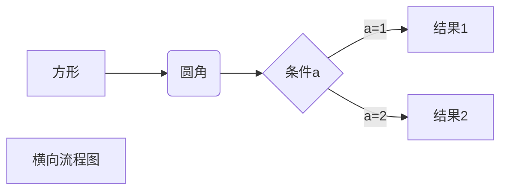

# ToCompiler

## introduce
  本项目是用来记录学习编译原理并开发一门编程语言的记录型项目       
 
## MarkDown  
### 标题
  ‘# 是一级标题’  
  ‘## 是二级标题’  
  ‘### 是三级标题’  
  ‘#### 是四级标题’  
  ‘##### 是五级标题’  
  ‘###### 是六级标题’
  
  
### 字体
       
  *斜体文本*   
\*斜体文本\*   
**粗体文本**   
\**粗体文本\**    
***粗斜体文本***    
\*\**粗斜体文本\**\* 

### 段落

换行在末尾加上 两个以上的空格便好

### 分割线

三个以上的\*  ,\-, \_ 便可

***
---
___

  
### 删除线
文字首位端加上 \~\~  即可
eg: 
google.com
~~campuselife.com~~

### 下划线  
使用\<u\>标签

<u>tocompiler</u>

### 脚注
为了梦想[^Tower]。

[^Tower]: 我是刘涛，我为价值代言！！！   


### 列表
#### 无序列表

* 第一项
* 第二项
* 第三项

+ 第一项
+ 第二项
+ 第三项

- 第一项
- 第二项
- 第三项

#### 有序列表
1. 第一项
2. 第二项
3. 第三项


### 区块
区块引用是： \> 段落 空格

> 区块引用     
>> Java 
>>> 么啥可写了   
>> Python  

### 代码

1. 段落行内的片段:反引号包起来
`printf()`函数
2. 代码区块
```javascript
$(document).ready(function (){
    alert("tower");
})

```

### 链接

>\[链接名称\]\(链接地址\)   
[菜鸟markdown教程](https://www.runoob.com/markdown/md-link.html)

><链接地址>
<https://www.baidu.com>

##### 高级连接
可以用变量作为链接地址    
用变量“1”做地址[Google][1]
用tower 做变量 [Tower][tower]

[1]:http://www.google.com
[tower]:http://www.campuselife.com


### 图片


同样可以使用变量来应用地址

![alt content][address]

[address]: http://static.runoob.com/images/runoob-logo.png    

不支持自定义长宽高，但可以使用html的img标签     


### 表格

| 表头1     | 表头2   |表头3|
|:------:|---------:|:----------|
|单元格|单元格|单元格|


### Markdown 高级技巧
#### 支持HTML元素
>使用 <kbd>Ctrl</kbd>+<kbd>Alt</kbd>+<kbd>Del</kbd> 重启电脑

#### 转义
"\\"

#### 公式

插入数学公式时，使用两个美元符（$$）包裹Tex或LaTex的数学公式来实现

$$
\mathbf{V}_1 \times \mathbf{V}_2 =  \begin{vmatrix} 
\mathbf{i} & \mathbf{j} & \mathbf{k} \\
\frac{\partial X}{\partial u} &  \frac{\partial Y}{\partial u} & 0 \\
\frac{\partial X}{\partial v} &  \frac{\partial Y}{\partial v} & 0 \\
\end{vmatrix}
$$tep1}{\style{visibility:hidden}{(x+1)(x+1)}}
$$


